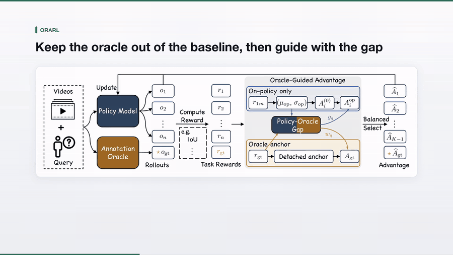
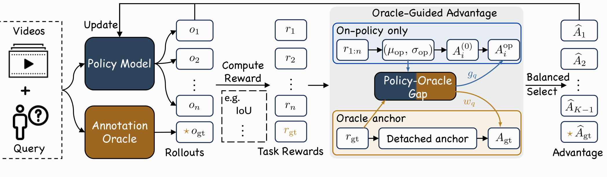
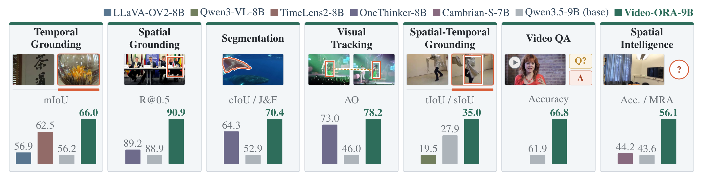
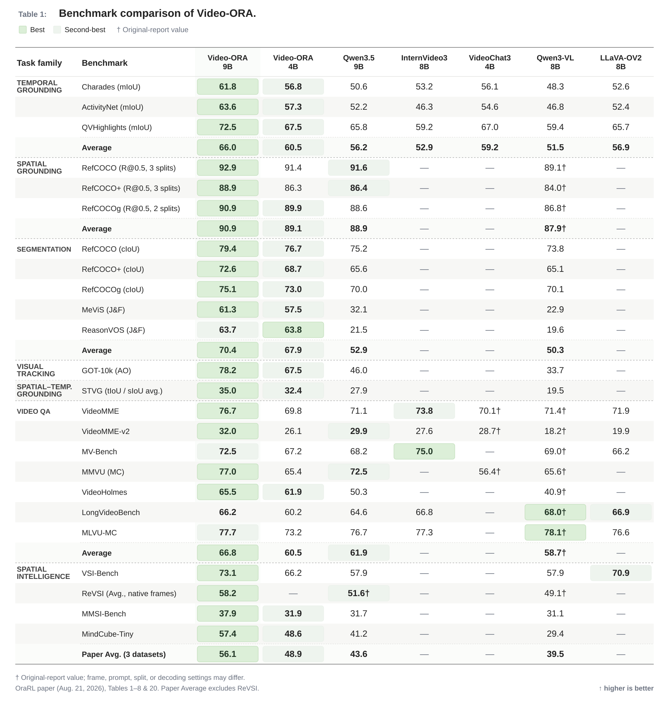
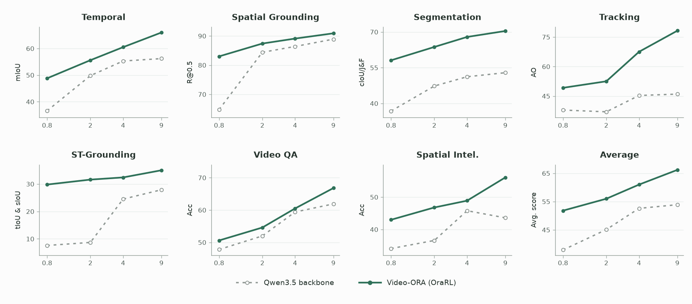
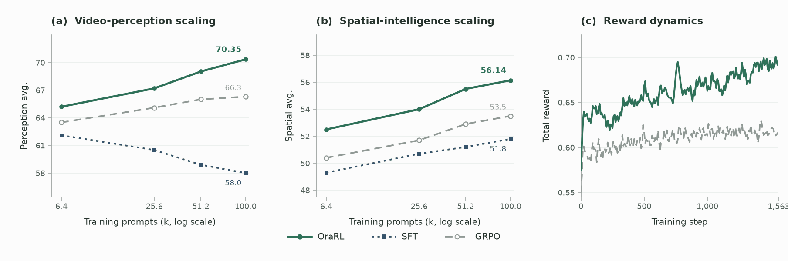

<p align="right"><a href="README.md">English</a></p>

<div align="center">

# OraRL

### 将标注作为 Rollout

**面向统一视频多模态大模型的高效、可扩展强化学习**

Yunheng Li · Guohong Mu · Hao Li · Shengsheng Qian · Dingwen Zhang ·
Qibin Hou · Ming-Ming Cheng

<p>
  <a href="https://arxiv.org/abs/2608.20492">📄 论文</a>
  &nbsp;&nbsp;·&nbsp;&nbsp;
  <a href="https://orarl.github.io/">🌐 项目主页</a>
  &nbsp;&nbsp;·&nbsp;&nbsp;
  <a href="#models">🤗 模型（4B / 9B）</a>
</p>
<p>
  <a href="docs/environment_zh.md">⚙️ 环境</a>
  &nbsp;&nbsp;·&nbsp;&nbsp;
  <a href="docs/training_zh.md">🚀 训练</a>
  &nbsp;&nbsp;·&nbsp;&nbsp;
  <a href="docs/evaluation_zh.md">📊 评测</a>
  &nbsp;&nbsp;·&nbsp;&nbsp;
  <a href="LICENSE">⚖️ 许可证</a>
</p>

<a href="https://orarl.github.io/assets/orarl-teaser.mp4">
  
</a>

**▶ 点击图片观看 1 分 38 秒的项目介绍视频。**

</div>

## 为什么选择 OraRL

- **将标注作为 Rollout：** 将标注转化为可靠的正样本 rollout，同时策略样本
  仍使用纯 on-policy 基线。
- **七类任务统一训练：** 同一套更新规则覆盖时序定位、空间定位、分割、跟踪、
  时空定位、视频问答和空间智能。
- **高效训练（4B）：** 符号均衡剪枝带来 **1.48× 的更新加速**
  （**92.5 → 62.4 秒/步**），同时将单卡峰值显存从 **62.4 GB 降至
  50.9 GB**。
- **高效推理：** 在单张 H20 上使用 vLLM 和 BF16 时，权重加载占用分别为
  **8.6 GiB（4B）**和 **17.6 GiB（9B）**。对于 2 fps 采样的十分钟视频，
  仅生成答案将首 token 后的中位延迟从 **4.78 秒降至 130 毫秒**，并将总
  中位延迟从 **29.03 秒降至 24.30 秒**。
- **多模态 veRL 基础设施：** 统一的视频数据契约支持缓存产物、原始路径和内联
  帧张量，并贯通 vLLM rollout 与 FSDP 更新；同时加入单次解码帧复用、时序
  元数据、按任务分组的批处理、异步 Ray 奖励和安全的混合引擎缓存处理。

## 一次 OraRL 更新

<p align="center">
  
</p>

一次 OraRL 更新将可靠的标注引导与 on-policy 归一化明确分开：

1. **构造样本组：** 在同一 prompt 的策略样本后加入一个序列化标注 rollout。
2. **保持 on-policy 基线：** 仅使用策略样本的奖励估计组内基线。
3. **引导并筛选：** 将标注与策略样本的奖励差转化为修正量，再选择符号均衡的
   子集执行更新。

该设计直接使用任务原生标注，不需要思维链监督或解码。

## Video-ORA 结果

<p align="center">
  
</p>

### 数据集级结果

<picture>
  <source media="(prefers-color-scheme: dark)"
          srcset="assets/video_ora_benchmark_matrix_dark.svg">
  <source media="(prefers-color-scheme: light)"
          srcset="assets/video_ora_benchmark_matrix_light.svg">
  
</picture>

Video-ORA-9B 在不使用思维链解码的情况下，在统一的七类任务对比中取得领先。
每行的最佳和次佳结果均已突出显示；`†` 表示该数值来自原始报告，其帧数、提示词、
数据划分或解码设置可能不同。仅在完整覆盖该任务类别时才计算类别平均值。

<!-- <details>
<summary>基准来源</summary>

未标注的数值来自最新版 [OraRL 论文](https://arxiv.org/abs/2608.20492)的表 1–8 和附录表 20。
外部数值来自
[LLaVA-OneVision-2](https://arxiv.org/abs/2605.25979)、
[VideoChat3](https://github.com/MCG-NJU/VideoChat3) 和
[OneThinker](https://arxiv.org/abs/2512.03043) 的原始报告。
此处仅将 OneThinker 作为公开 Qwen3-VL 分数的来源。ReVSI 使用各模型报告的
帧设置；论文中的三基准空间智能平均值不包含 ReVSI。

</details> -->

### 模型规模扩展

<p align="center">
  
</p>

### 数据规模扩展

<p align="center">
  
</p>

<a id="models"></a>

## 模型

| 模型 | 基座模型 | 发布配置 | 权重 |
| --- | --- | --- | --- |
| **Video-ORA-9B** | Qwen3.5-9B | `orarl_9b.yaml` | [Hugging Face](https://huggingface.co/OraRL/Video-ORA-9B) |
| **Video-ORA-4B** | Qwen3.5-4B | `orarl_4b.yaml` | Hugging Face（即将发布） |

### vLLM 部署

两个 Video-ORA 检查点均可通过 **vLLM 0.19.1** 直接提供兼容 OpenAI 的
推理服务：

```bash
MODEL=OraRL/Video-ORA-9B

vllm serve "$MODEL" \
  --served-model-name Video-ORA-9B \
  --trust-remote-code \
  --dtype bfloat16 \
  --tensor-parallel-size 1 \
  --max-model-len 131072 \
  --limit-mm-per-prompt '{"image": 1, "video": 1}'
```

多卡部署时，将 `--tensor-parallel-size` 设为 GPU 数量；显存较小时可降低
`--max-model-len`。如需仅生成答案，请在聊天模板中设置
`enable_thinking=false`。

## 使用 OraRL

本仓库围绕三个面向用户的工作流组织：

1. **[环境](docs/environment_zh.md)：** 安装同时覆盖自带训练运行时与评测运行时的
   固定 CUDA 软件栈。
2. **[训练](docs/training_zh.md)：** 准备已获许可的本地训练数据，并启动单节点或
   多节点 GRPO/OraRL。
3. **[评测](docs/evaluation_zh.md)：** 下载 Video-ORA 和 OraRL-Data，运行
   smoke test 或完整论文评测。

训练和评测默认仅执行 dry run；检查解析后的命令后再添加 `--run`。Checkpoint
和评测媒体托管在 [OraRL Hugging Face 组织](https://huggingface.co/OraRL)下。

## 致谢

OraRL 基于 [veRL](https://github.com/volcengine/verl) 构建——这是一个采用
HybridEngine 的高性能强化学习框架。感谢其作者和贡献者开源训练基础设施。

## 许可证

OraRL 源代码采用 [Apache-2.0](LICENSE) 许可证发布。数据集、模型、基准和可选
依赖仍遵循各自的原始许可证，详情请参阅 [NOTICE](NOTICE)。

## 引用

如果 OraRL 对您有所帮助，欢迎为本仓库点亮 ⭐，并引用我们的
[论文](https://arxiv.org/abs/2608.20492)。

```bibtex
@article{li2026orarl,
  title   = {Annotations as Rollouts: Efficient and Scalable
             Reinforcement Learning for Video MLLMs},
  author  = {Li, Yunheng and Mu, Guohong and Li, Hao and
             Qian, Shengsheng and Zhang, Dingwen and Hou, Qibin
             and Cheng, Ming-Ming},
  journal = {arXiv preprint arXiv:2608.20492},
  year    = {2026},
  url     = {https://arxiv.org/abs/2608.20492}
}
```
